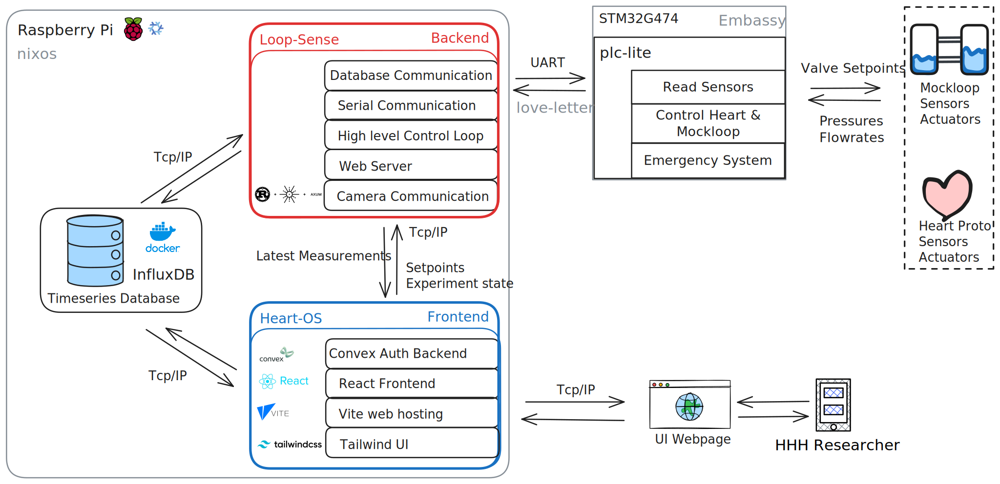

# PLC-lite: Holland Hybrid Heart Mockloop Firmware

This repository contains embedded firmware for the Holland Hybrid Heart (HHH) mockloop system, written in Rust using the Embassy async framework.

## About the Holland Hybrid Heart Project

The [Holland Hybrid Heart](https://hollandhybridheart.nl/) project aims to develop a biocompatible artificial
heart using soft robotics and tissue engineering. This innovative artificial
heart is designed to help heart failure patients by improving life expectancy
and quality of life. It reduces the dependency on donor hearts, addressing the
shortage of available donor organs and improving patient outcomes.

## What is a Mockloop?

A mockloop (also called a mock circulatory loop) is a physical simulator that replicates the human cardiovascular system for testing cardiac devices. It consists of:

- **Pumps** that simulate heart ventricles
- **Pressure chambers** representing different parts of the circulatory system
- **Flow sensors** and **pressure sensors** for monitoring
- **Controllable resistances** to simulate blood vessel properties
- **Compliance chambers** to mimic arterial elasticity

Mockloops are essential for:

- Testing artificial hearts and ventricular assist devices
- Validating control algorithms in a controlled environment
- Collecting performance data before animal or clinical trials
- Training medical professionals on the artificial heart device operation

## Mockloop Architecture



## Firmware Architecture

This firmware is built using modern async Rust with the following key components:

### High-Level Architecture

```
┌─────────────┐    ┌─────────────┐    ┌─────────────┐
│ RCC Config  │────│  Main Task  │────│  Hardware   │
│             │    │             │    │     HAL     │
└─────────────┘    └─────────────┘    └─────────────┘
                          │
                     ┌────▼────┐
                     │ Subtasks│
                     └─────────┘
                          │
                          ▼
            ┌─────────────────────────────────────┐
            │ ADC │ LED │ UART │ Button │ Control │
            │Task │Task │ Task │  Task  │  Task   │
            └─────────────────────────────────────┘
```

**Main Task Responsibilities:**

- Configure Reset and Clock Control (RCC)
- Initialize hardware peripherals for the target board through the HAL layer
- Spawn subtasks using Embassy's async executor, together these run the main application logic
- Set up inter-task communication channels

**Subtask Architecture:**

- **ADC Task**: Continuously samples analog sensors (pressure, flow)
- **Control Task**: Implements mockloop control algorithms, collects ADC frames, Setpoints and Application state into a Report
- **Communication Task**: Handles UART communication with the host (Raspberry Pi)
- **LED Task**: Provides visual application status feedback
- **Button Task**: Handles user button, currently toggles application state

**Key Technologies:**

- **Embassy Framework**: Provides async/await support for embedded systems
- **Hardware Abstraction Layer (HAL)**: Supports both STM32F103 and STM32G474 microcontrollers, easily adapted to any stm32 family
- **Real-time Communication**: UART/COBS based communication protocol to send Reports to and receive setpoints from the host
- **Sensor Integration**: Multi-channel ADC for fast pressure and flow monitoring

## Development Environment Setup

This project uses [Nix](https://nixos.org/) for reproducible development environments, ensuring all developers have identical toolchains regardless of their host operating system.

### Installing Nix

#### Windows (WSL2 recommended)

```bash
# Install WSL2 first, then in WSL2:
curl --proto '=https' --tlsv1.2 -sSf -L https://install.determinate.systems/nix | sh -s -- install
```

#### macOS

```bash
curl --proto '=https' --tlsv1.2 -sSf -L https://install.determinate.systems/nix | sh -s -- install
```

#### Linux

```bash
curl --proto '=https' --tlsv1.2 -sSf -L https://install.determinate.systems/nix | sh -s -- install
```

After installation, restart your terminal or source the Nix environment:

```bash
source ~/.nix-profile/etc/profile.d/nix.sh
```

### Enable Nix Flakes (if not already enabled)

```bash
echo "experimental-features = nix-command flakes" >> ~/.config/nix/nix.conf
```

### Entering the Development Shell

The project includes a Nix flake that provides all necessary development tools:

```bash
# Clone the repository
git clone <repository-url>
cd plc-lite

# Enter the development shell (this may take a few minutes the first time)
nix develop

# Alternative: if you have direnv installed and configured
echo "use flake" > .envrc
direnv allow
```

The development shell provides:

- **Rust toolchain** with embedded targets
- **probe-rs-tools** for flashing and debugging
- **GCC ARM toolchain** for additional debugging tools
- **OpenOCD** for alternative hardware debugging
- **tio** to inspect serial communication
- **rust-analyzer** for IDE LSP support

## Building the Project

Once in the Nix development shell, you can use standard Cargo commands:

### Build for the default target (STM32G474RE)

```bash
cargo build
```

### Build for release (optimized)

```bash
cargo build --release
```

### Build for STM32F103C6

```bash
cargo build --no-default-features --features stm32f103c6
```

### Check code without building

```bash
cargo check
```

### Run tests

```bash
cargo test
```

### Format code

```bash
cargo fmt
```

### Run linter

```bash
cargo clippy
```

## Hardware Targets

The firmware supports two microcontroller variants:

- **STM32G474RE** (default): Higher performance Cortex-M4F with 512KB flash, 128KB RAM
- **STM32F103C6**: Lower cost Cortex-M3 with 32KB flash, 10KB RAM, used for development

**Note**: STM32F103C6 target is currently broken 😔. PR's are welcome

## Project Structure

```
src/
├── main.rs             # Entry point, RCC config, task spawning
├── hal/                # Hardware abstraction layer
│   ├── mod.rs          # HAL facade
│   ├── stm32g474re.rs  # STM32G474RE-specific implementation
│   └── stm32f103c6.rs  # STM32F103C6-specific implementation
├── adc_task.rs         # Analog sensor reading task
├── button_task.rs      # User input handling
├── comms_task.rs       # UART communication with host
├── control_task.rs     # Mockloop & Heart control loops
├── framing_task.rs     # Message serialization/deserialization
└── led_task.rs         # Status LED management
```

## Getting Started

1. **Set up your development environment** following the Nix installation instructions above
2. **Enter the development shell to obtain the right toolchain**: `nix develop`
3. **Build the firmware**: `cargo build`
4. **Connect your hardware** via probe-rs compatible debugger (i.e. STlinkv2 for STM32F103, or the integrated STLink on the stm32g474re devkit)
5. **Flash the firmware**: `cargo run`

## Contributing

This is an academic research project. If you're a student working on this system:

1. Learn about Rust by reading the [Rust book](https://doc.rust-lang.org/stable/book/) and working on [Rustlings](https://rustlings.rust-lang.org/)
2. Study the [embedded](https://docs.rust-embedded.org/book/) Rust [ecosystem](https://github.com/rust-embedded/awesome-embedded-rust)
3. Ensure you understand the async/await model in Rust
4. Familiarize yourself with Embassy's task model and inter-task communication structures in embassy-sync
5. Always test changes on hardware before submitting
6. Document any communication protocol changes in the love-letter shared communication library crate

## Maintainer Contact

Max Kivits: m.p.w.kivits@saxion.nl
